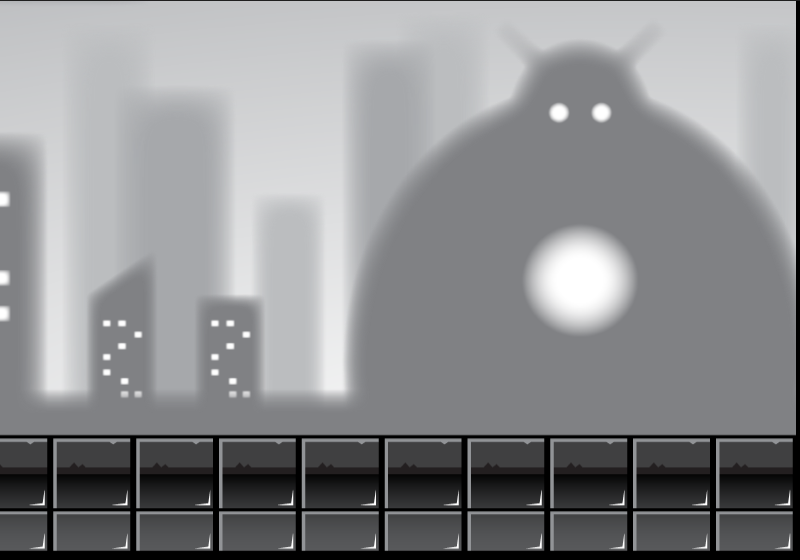
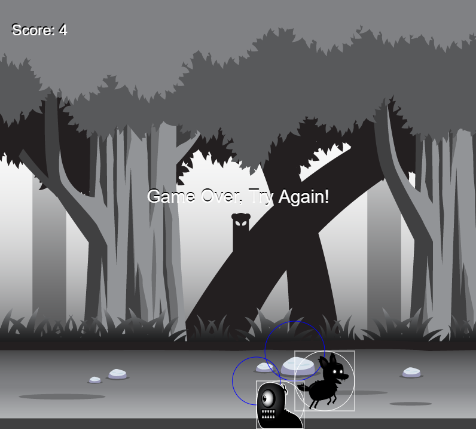
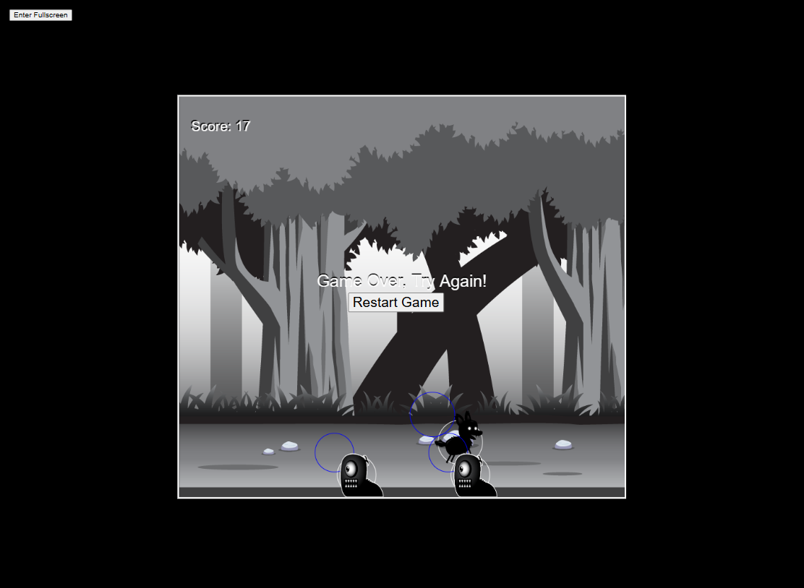
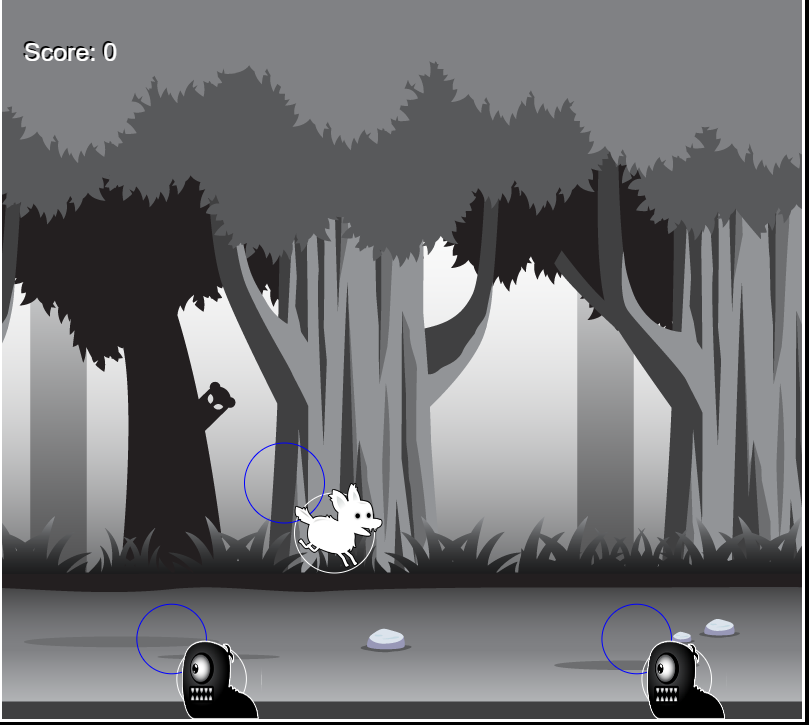

# Canvas-Magic
Use Canvas to do 2D special effects and games.

Up to now, implemented effects as blow:
## 1 - Special particles
Special particles effects when mouse click or move, particles will be generated and destoried with different color and speed.

## 2 - Special matrix rain like haker attack
Matirx rain effects, with canvas linear gradient.

## 3 - Sprite dog animation
Sprite dog animation implemented, with canvas drawImage.
How to get a image and insert into a frame, is important for this animation.

## 4 - Parallax background animation

Parallax background can animate align at x coordiate, make x is negative to implement background move. How to remove gap between frames, is the important.

## 5 - Flying creatures 
Flying creature implemented with different animate path.

## 6 - Game Tutorials 1 - Wolf Escape
Game Rules: Avoid to touch enemy, otherwise game over. Escape each enemy, get 1 score.

With Parallax backgound, sprite animation, keyboard input handler and circle collision detection to implement a simple game.

[updated] Support mobile mode, full screen and optimize collision detection.

## 7 - Game Tutorials 1 - Wolf Escape - code refactor for state management
code refactor for state management, use ArrowUp, ArrowDown, ArrowRight, and ArrowLeft to see the animation.

